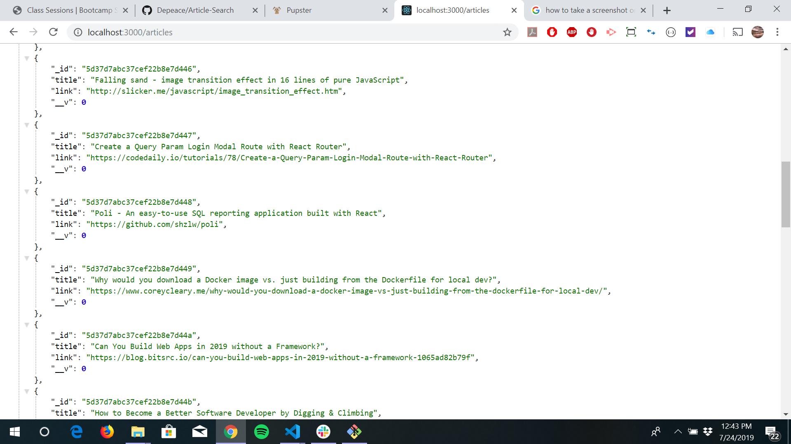
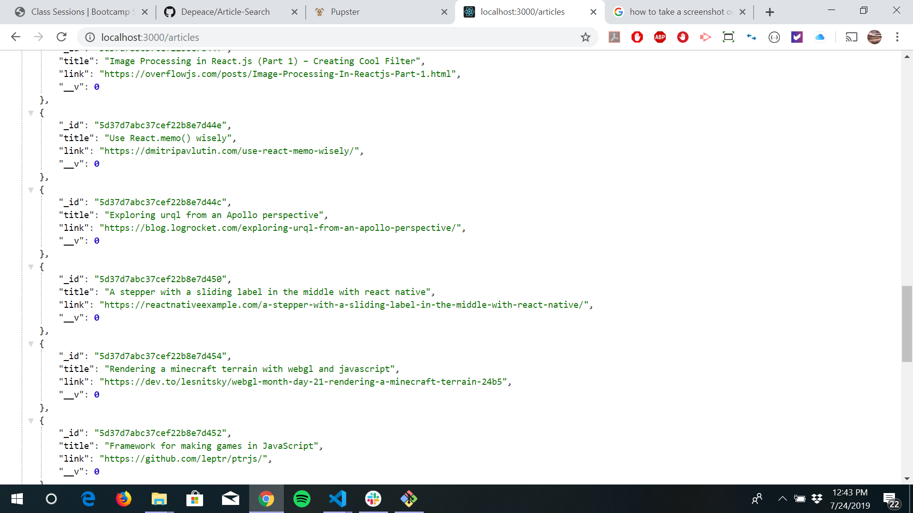
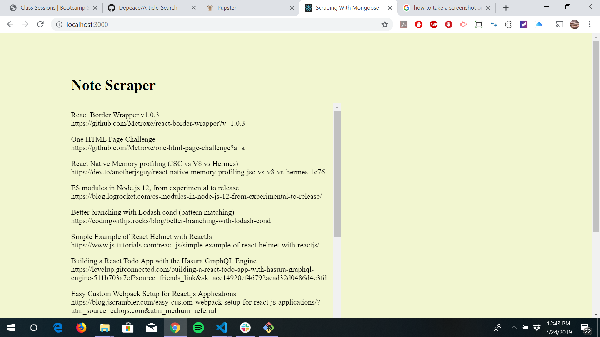
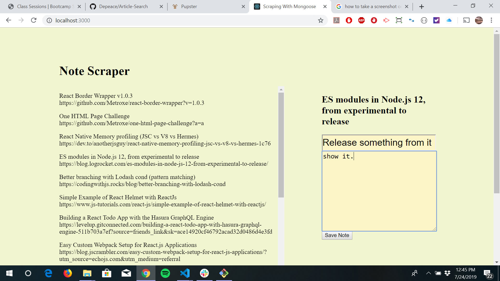
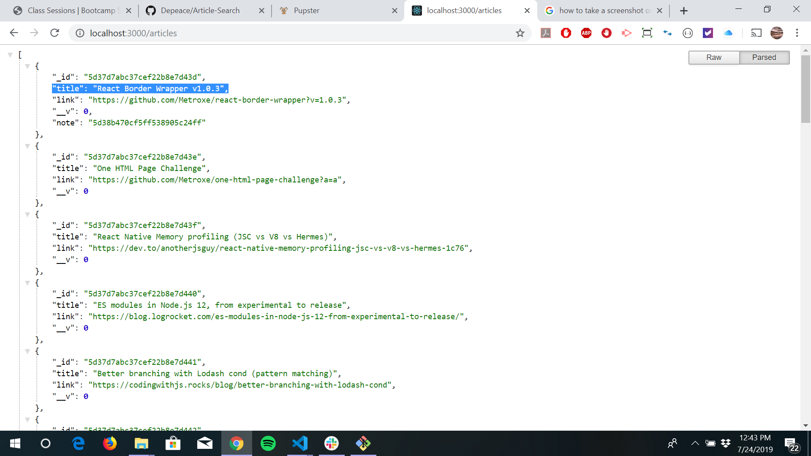

       Web-app

Article Search

The application will let the user scrape news articles from New York Times website. When the user clicks on Scrape Article button a certain amount of articles will get displayed as a card with the following information Title, Link to the Article(Click on "Go to the article link"), Summary and byline if it's available from New York Times on the web page.

The user can save the article by clicking on Save Article button. The saved article can be viewed by clicking on Saved Article link present in the Navbar.

A note can be created in the saved article by clicking on Create Notes button. Once the button is clicked a modal will get displayed for the user to create a note. As many number of notes can be created for a particular article, and the note is displayed for all the users who wants to view the note. A note can be deleted by clicking on the delte button on the side of the note.

Dependencies

1.express      
2.express-handelebars
3.mongoose
4.cheerio
5.axios

